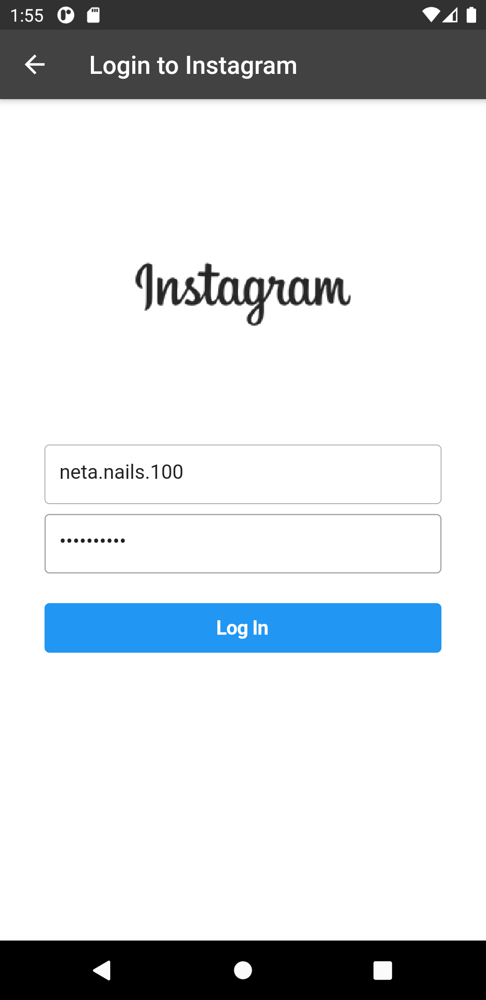

# flutter_instagram_image_picker

A Flutter package for picking images from Instagram

## Getting Started

This plugin displays a gallery with user's Instagram Albums and Photos, based on the access token provided.
It does handle authorization and login by itself.\
Then just provides access token to the gallery.

### Usage
1.Check if user has logged in, if not prompt him to enter his login data using by navigation to the `InstagramLoginPage`
```dart
Map loginMap;
bool isLogged = await InstagramAuth().isLogged;
// check if user already logged in, if not log the user using the
// WebView interface
if (!isLogged) {
  loginMap = await Navigator.push(
      context,
      MaterialPageRoute(
        builder: (_) => InstagramLoginPage(),
      ));

  // if user canceled the operation
  if (loginMap == null)
    return;

  // try to log in the user
  await InstagramAuth().login(loginMap['username'], loginMap['password']);
}
```
 
2.Check if the user logged in successfully by accessing his data.
```dart
final accessMapData = await InstagramAuth().accessData;
if(accessMapData == null){
  return null;
}
```

3.After we got the access data, we can navigate to `InstagramImagePicker`:
```dart
Navigator.push(
  context,
  MaterialPageRoute(
    builder: (context) => InstagramImagePicker(
      accessMapData,
      showLogoutButton: true,
      onDone: (items) {
        Navigator.pop(context);
      },
      onCancel: () => Navigator.pop(context),
    ),
  ),
);
,
```

## Screenshots
* Login Page:


* Image Picker:


* Image Picker (after selection):
